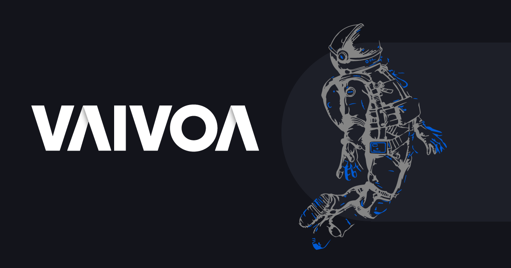

 

 
 
 
 

# Vaivoa Tech School

Acelere sua carreira de tecnologia com uma experiência diferente de tudo que você já viu. 12 semanas de imersão em tecnologias modernas que irá te preparar para os desafios reais de programação do dia-a-dia.

Criada pelo Modalmais, o banco digital dos investidores, Vaivoa é uma escola orientada para acelerar a carreira de Devs Juniores. Com nosso programa de aceleração de 12 semanas em Backend, você irá ser desafiado(a) a crescer profissionalmente com uma equipe dedicada de mentores e uma stack de tecnologia moderna.

Conheça mais sobre o programa [no nosso site](https://vaivoa.com/).

Conheça mais [sobre o Modalmais](https://www.modalmais.com.br/).
